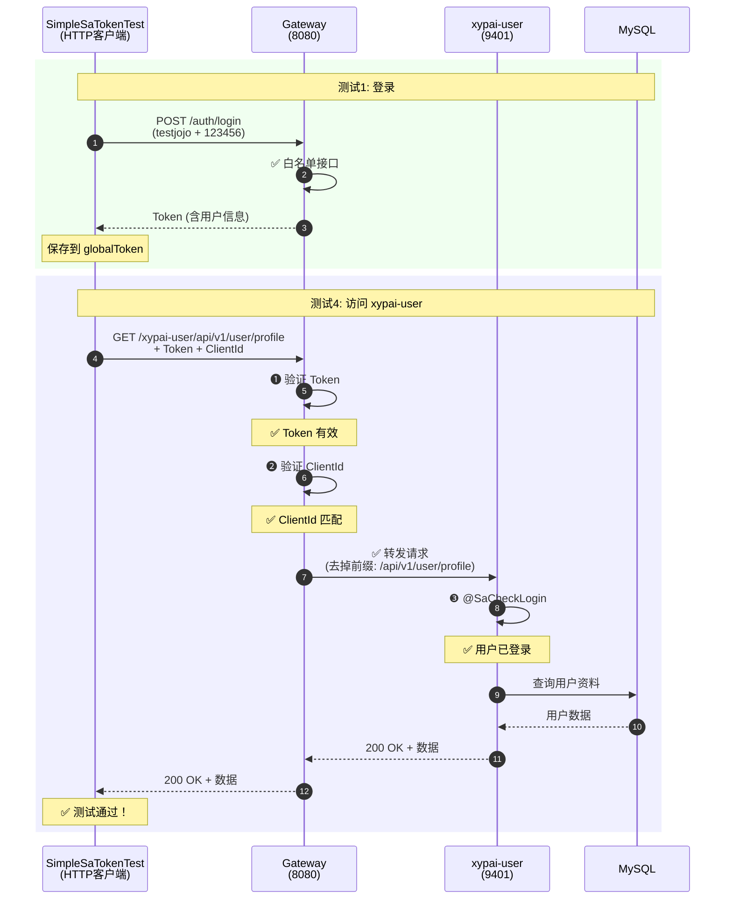

# 🎯 xypai-user 服务集成测试指南

## ✅ 已完成的修改

### 1. UserController 权限调整（临时测试）

已将以下接口从 `@SaCheckPermission` 改为 `@SaCheckLogin`（只需登录，无需具体权限）：

```java
// ✅ 已修改的接口
@SaCheckLogin  // 原来: @SaCheckPermission("xypai:user:list")
GET /api/v1/user/list          // 分页查询用户列表

@SaCheckLogin  // 原来: @SaCheckPermission("xypai:user:query")
GET /api/v1/user/profile       // 获取当前用户资料

@SaCheckLogin  // 原来: @SaCheckPermission("xypai:user:query")
GET /api/v1/user/{userId}      // 根据ID查询用户

// ✅ 保持不变（本来就是 @SaCheckLogin）
POST /api/v1/user/heartbeat    // 心跳接口
```

### 2. SimpleSaTokenTest 新增测试

```
测试1 (@Order 1): 登录获取 Token ✅
测试2 (@Order 2): 访问 ruoyi-demo ⚠️ 需要权限
测试3 (@Order 3): 访问 xypai-content ✅
测试4 (@Order 4): 访问 xypai-user ✅ 新增！
  ├─ 子测试1: GET /profile
  ├─ 子测试2: GET /{userId}
  └─ 子测试3: GET /list
测试5 (@Order 5): 访问 ruoyi-system ⚠️ 需要权限
测试6 (@Order 6): 心跳接口 ✅ 新增！
```

## 🚀 运行测试

### 前置条件

确保以下服务已启动：

```bash
# ✅ 必须启动的服务
1. Gateway (8080)
2. ruoyi-auth (9210)
3. xypai-user (9401)  ← 关键！
4. Redis (6379)
5. MySQL (3306)

# ⚠️ 可选服务（其他测试需要）
6. xypai-content (9403) - 测试3需要
7. ruoyi-demo (9401) - 测试2需要
8. ruoyi-system (9201) - 测试5需要
```

### 运行测试命令

```bash
# 方法1: 只运行 xypai-user 相关测试
cd ruoyi-auth
mvn test -Dtest=SimpleSaTokenTest#test1_Login
mvn test -Dtest=SimpleSaTokenTest#test4_AccessUserService
mvn test -Dtest=SimpleSaTokenTest#test6_Heartbeat

# 方法2: 运行所有测试（按顺序）
mvn test -Dtest=SimpleSaTokenTest

# 方法3: 在 IDEA 中运行
# 右键 SimpleSaTokenTest 类 → Run 'SimpleSaTokenTest'
```

## 📊 预期测试结果

### ✅ 测试1: 登录成功

```
✅✅✅ 测试1完成 - 登录成功！✅✅✅
   ✅ 通过Gateway调用登录接口成功
   ✅ Token验证通过
   ✅ globalToken已保存: eyJhbGciOiJSUzI1NiIsInR5cCI6Ik...
```

### ✅ 测试4: 访问 xypai-user 服务

```
━━━━━━━━━━━━━━━━━━━━━━━━━━━━━━━━━━━━━━━━━━━━━━
  👤 测试4: 使用globalToken访问XYPai-User Service
━━━━━━━━━━━━━━━━━━━━━━━━━━━━━━━━━━━━━━━━━━━━━━

📤 发送Gateway请求 (测试1/3):
   URL: http://localhost:8080/xypai-user/api/v1/user/profile
   方法: GET
   接口说明: 获取当前用户资料（xypai-user模块）
   权限要求: @SaCheckLogin (只需登录)

📥 收到Gateway响应:
   HTTP状态码: 200 OK
   响应体: {"code":200,"msg":"操作成功","data":{"userId":2000,...}}
   ✅ 测试1通过: 获取用户资料成功

📤 发送Gateway请求 (测试2/3):
   URL: http://localhost:8080/xypai-user/api/v1/user/2000
   方法: GET
   接口说明: 根据ID查询用户
   测试用户ID: 2000

📥 收到Gateway响应:
   HTTP状态码: 200 OK
   ✅ 测试2通过: 根据ID查询用户成功

📤 发送Gateway请求 (测试3/3):
   URL: http://localhost:8080/xypai-user/api/v1/user/list?pageNum=1&pageSize=10
   方法: GET
   接口说明: 分页查询用户列表

📥 收到Gateway响应:
   HTTP状态码: 200 OK
   ✅ 测试3通过: 分页查询用户列表成功

✅✅✅ 测试4成功！✅✅✅
   ✅ XYPai-User Service响应正常
   ✅ @SaCheckLogin 认证通过
   ✅ 已移除 @SaCheckPermission 权限检查
   💡 现在可以正常访问 xypai-user 接口了！
```

### ✅ 测试6: 心跳接口

```
━━━━━━━━━━━━━━━━━━━━━━━━━━━━━━━━━━━━━━━━━━━━━━
  💓 测试6: 心跳接口测试
━━━━━━━━━━━━━━━━━━━━━━━━━━━━━━━━━━━━━━━━━━━━━━

📤 发送心跳请求:
   URL: http://localhost:8080/xypai-user/api/v1/user/heartbeat
   方法: POST
   接口说明: 更新用户最后在线时间
   权限要求: @SaCheckLogin (只需登录)

📥 收到响应:
   HTTP状态码: 200 OK
   响应体: {"code":200,"msg":"操作成功","data":null}

✅✅✅ 测试6成功！✅✅✅
   ✅ 心跳接口响应正常
   ✅ 最后在线时间已更新
```

## 🔍 完整的请求流程



## ⚠️ 重要说明

### 1. 权限修改是临时的

```java
// ⚠️ 这些修改仅用于测试，生产环境必须恢复权限检查！

// 测试完成后，需要还原为：
@SaCheckPermission("xypai:user:list")
@SaCheckPermission("xypai:user:query")
```

### 2. 为什么可以访问？

```mermaid
graph TD
    A[请求到达 Gateway] --> B{Token 有效?}
    B -->|✅ 有效| C{ClientId 匹配?}
    B -->|❌ 无效| E1[401 认证失败]
    
    C -->|✅ 匹配| D[转发到 xypai-user]
    C -->|❌ 不匹配| E2[401 ClientId 不匹配]
    
    D --> F{接口权限检查}
    F -->|@SaCheckLogin| G[只验证登录状态]
    F -->|@SaCheckPermission| H[验证具体权限]
    
    G --> I{已登录?}
    I -->|✅ 是| J[✅ 200 OK]
    I -->|❌ 否| E3[401 未登录]
    
    H --> K{有权限?}
    K -->|✅ 有| J
    K -->|❌ 无| E4[403 权限不足]
    
    style J fill:#51cf66
    style E1 fill:#ff6b6b
    style E2 fill:#ff6b6b
    style E3 fill:#ff6b6b
    style E4 fill:#ff6b6b
```

**关键点**：
- ✅ Gateway 验证 Token 有效性（认证层）
- ✅ xypai-user 服务只验证登录状态（`@SaCheckLogin`）
- ❌ 不再验证具体权限（已注释 `@SaCheckPermission`）

### 3. 完整认证链路

| 层级 | 组件 | 检查项 | 结果 |
|------|------|--------|------|
| **1. Gateway** | AuthFilter | Token 有效性 | ✅ 通过 |
| **2. Gateway** | AuthFilter | ClientId 匹配 | ✅ 通过 |
| **3. Service** | Controller | @SaCheckLogin | ✅ 通过（已登录） |
| **4. Service** | Controller | ~~@SaCheckPermission~~ | ⚠️ 已注释（测试期间） |

## 🔧 故障排查

### 问题1: xypai-user 服务未启动

```bash
❌ 测试4失败: Connection refused
   可能原因:
   1. XYPai-User Service未启动 (端口 9401)

# 解决方案：
cd xypai-user
mvn spring-boot:run

# 或在 IDEA 中：
# 右键 XyPaiUserApplication → Run
```

### 问题2: 仍然返回 403

```bash
❌ 测试4失败: {"code":403,"msg":"权限不足"}

# 可能原因：
# 1. UserController 的权限注解没有修改成功
# 2. 使用了编译后的旧 class 文件

# 解决方案：
cd xypai-user
mvn clean compile  # 重新编译
mvn spring-boot:run  # 重启服务
```

### 问题3: Token 过期

```bash
❌ 测试4失败: {"code":401,"msg":"认证失败"}

# 解决方案：
# 重新运行测试1获取新 Token
mvn test -Dtest=SimpleSaTokenTest#test1_Login
```

## 📋 测试检查清单

运行测试前，请确认：

- [ ] Gateway 服务已启动 (8080端口)
- [ ] ruoyi-auth 服务已启动 (9210端口)
- [ ] **xypai-user 服务已启动 (9401端口)** ← 关键！
- [ ] Redis 已启动 (6379端口)
- [ ] MySQL 已启动 (3306端口)
- [ ] 测试用户 `testjojo` 已创建（密码: 123456）
- [ ] UserController 权限注解已修改为 `@SaCheckLogin`
- [ ] xypai-user 服务已重新编译和启动

## 🔄 恢复权限配置

测试完成后，恢复生产环境配置：

```java
// 1. 恢复 UserController 的权限注解
@SaCheckPermission("xypai:user:list")    // 恢复
@GetMapping("/list")
public TableDataInfo<UserVO> list(UserQueryDTO queryDTO) {
    return userService.selectUserList(queryDTO);
}

@SaCheckPermission("xypai:user:query")   // 恢复
@GetMapping("/profile")
public R<UserVO> getProfile() {
    Long userId = LoginHelper.getUserId();
    return R.ok(userService.selectUserById(userId));
}

@SaCheckPermission("xypai:user:query")   // 恢复
@GetMapping("/{userId}")
public R<UserVO> getUserById(@PathVariable Long userId) {
    return R.ok(userService.selectUserById(userId));
}

// 2. 执行权限配置 SQL（如果需要）
mysql -u root -p ry-cloud < xypai-user/sql/permission_menu.sql

// 3. 重启 xypai-user 服务
```

## 📚 相关文档

- [401 错误完整解决方案](../../../xypai-user/docs/401_ERROR_SOLUTION.md)
- [超级管理员权限机制](../../../xypai-user/docs/SUPER_ADMIN_PERMISSIONS.md)
- [xypai-user vs ruoyi-system 对比](../../../xypai-user/docs/SATOKEN_COMPARISON.md)

---

**最后更新**: 2025-11-11  
**作者**: XyPai 开发团队

**✅ 现在您可以成功测试 xypai-user 服务了！** 🎉

